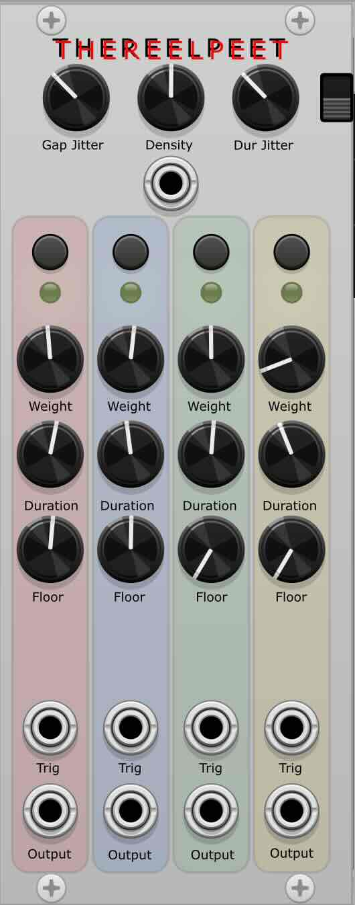

# THEREELPEET (Phrasing)



[Watch under 3 min demo](https://youtube.com/shorts/_wfb55v9VBA)

[Watch 1 min wip video](https://youtube.com/shorts/kH3QeOVfajg)

**THEREELPEET** Phrasing and presence controller. Shapes rests, repeats, changes, and level-focused dynamics; intended to drive VCAs or Morph 4-style level CV inputs.  
It produces long, breathing phrases — extended rests interrupted by smooth, musical rises and falls — to control presence, spotlighting, and dynamic emphasis across voices.

Not a sequencer. Not a trigger module.  
A form and breathing tool meant to sit above your sound generators.

The module is licensed under the [MIT license](./LICENSE).

## Overview

THEREELPEET creates four independent, slow-moving CV envelopes that decide **when** a voice should be present and **how present** it should be.

Each lane fires probabilistically on a global timed gap (controlled by Density), or can be forced on via a trig input.  
Outputs are shaped with attack and release times derived from the Duration knob, using one-pole smoothing for natural fades.

Primary role: drive VCA gain, mixer levels, Morph 4 macros, wavefolder bias, filter cutoff, or any parameter that benefits from slow, organic phrasing and ducking.

## Controls & I/O

### Global
- **Density** — knob + CV input (0–10 V)  
  Higher = shorter gaps between events (5–90 s base range, logarithmic)
- **Gap Jitter** — adds timing variation per event
- **Dur Jitter** — adds variation to on-time per event
- **Guarantee one** — switch: ensures at least one lane is always active (picks highest-weight lane)

### Per lane (×4)
- **Enable** toggle button + green activity light
- **Weight** — probability of firing during a gap event (0–1)
- **Duration** — base on-time (5–90 s logarithmic)
- **Floor** — minimum output level when lane is inactive (0–5 V)
- **Trig input** — rising edge (> ~1.7 V) forces lane on for full (jittered) duration

### Outputs
- Lane CV 1–4 — 0–5 V shaped envelopes

## Envelope Behavior
- Attack time ≈ 20% of Duration knob (clamped 30 ms – 2 s)
- Release time ≈ 40% of Duration knob (clamped 300 ms – 25 s)
- One-pole low-pass smoothing applied to target changes
- Floor parameter sets resting level (no hard off unless floor = 0)

## Intended Use
- Patch outputs to VCA gain or mixer channel levels → natural spotlighting / ducking
- Control wavefolder bias or filter cutoff → slow timbral breathing
- Combine with external LFOs or random sources → hybrid deterministic + probabilistic phrasing
- Use Guarantee-one mode for constant motion without full silence

## Compatible Physical Modules
THEREELPEET outputs 0–5 V smooth envelopes — ideal for controlling level, dynamics, and timbral parameters on Eurorack modules.

Recommended pairings:
- **VCAs** — Intellijel Quad VCA, Make Noise LxD, 4ms VCA Matrix, Doepfer A-130-8
- **Mixers / Matrix** — Intellijel Quadrax (via Qx), Make Noise Maths, 4ms SWN, Mutable Frames
- **Wavefolders / Timbre** — Instruo Tš-L, Mutable Ripples, Befaco Even VCO, Joranalogue Fold 6
- **Filters** — Mutable Ripples/Resonators, Instruo Cš-L, Doepfer A-106-5
- **Multi-function** — Make Noise Maths, Joranalogue Contour 1, Intellijel Quadrax

Best results with modules that accept unipolar 0–5/0–8/0–10 V CV and respond musically to slow changes.

## Compatible VCV Rack Modules
- **Bogaudio VCA / Quad VCA** — clean gain control
- **VCV Mixer / Audible Mixer** — channel level modulation
- **Bogaudio Morph / Vult Morpher** — macro grouping
- **Audible Ripples / Bogaudio Filter** — slow cutoff breathing
- **VCV ADSR / Bogaudio ADSR** — external envelope source
- **Impromptu Clocked / Phrase** — hybrid clocked + probabilistic phrasing
- **Bogaudio Slew** — soften edges if needed
- **VCV Scope** — visualize envelopes

Best with modules that accept unipolar CV and respond musically to slow changes.

## Building
Requires a working VCV Rack plugin development environment.  
See: https://vcvrack.com/manual/PluginDevelopmentTutorial

Clone into `plugins/` directory and run:
```bash
make


